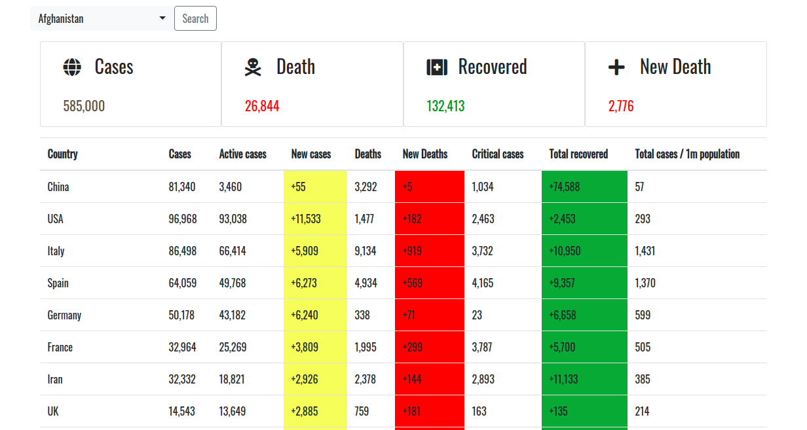

# Corona-virus-counter

<h1>About</h1>
Simple app for covid19 cases and all information from world. Contains else than it searching which is select component and it get information from API via rest service with total infomation from all over the world. 
                 
<t1>Tech stack</h1>
<ul>
  <li>Spring boot (applied : Webclient, MVC , multi module maven project model )</li>
  <li>jQuery</li>
</ul>

<h5>Used API : <a href="https://rapidapi.com/astsiatsko/api/coronavirus-monitor">RAPID API</h5>

<h1>Screenshots</h1>

